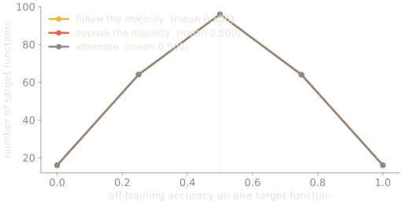

No new mechanism this week. Everything is already on the table, and the job is to
point it at ourselves.

## The punchline, handled carefully

Dunning-Kruger is what everyone expects this week to be about, and the honest
version is more interesting than the meme.

Krueger and Mueller argued in 2002 that the classic curve is substantially
reproducible from regression to the mean plus a better-than-average effect, with
no metacognitive deficit required. Kruger and Dunning replied in the same issue.
Burson, Larrick and Klayman raised related objections in 2006. The exchange is
unresolved, and the effect that survives is real but weaker and differently
shaped than the version in circulation.

Which puts us in an awkward and appropriate position: the single most famous
claim about not knowing what you don't know is itself a claim we don't fully
know. Grade <abbr class="grade grade-c" title="contested">[C]</abbr>, and notice that this is the best possible week 12 for this
course rather than an embarrassment for it.

*Two thousand simulated people, with no metacognitive deficit anywhere in the model — only a weak correlation between actual and estimated skill, plus a better-than-average shift. Averaged into quartiles, they reproduce the famous crossing lines. That does not show the effect is nothing; it shows the classic figure is not evidence for it.*

## The formal shape of the problem

Then the epistemology, which is where the course has been heading since week 1.

No observation tests a hypothesis alone — Duhem's point, sharpened by Quine in
1951 into the underdetermination thesis. Laudan and Leplin argue the thesis is far
weaker than usually claimed, and you should read them too, because teaching the
strong version unopposed would violate this course's own rules. Goodman's new
riddle is sharper than Hume's problem for our purposes: the difficulty isn't a
shortage of evidence but that evidence never uniquely fixes a hypothesis.

Agrippa's trilemma, via Sextus, is the formal skeleton. Any justification is
circular, infinite, or stops somewhere arbitrary. Pick a horn in the seminar and
defend it.

The formal result worth knowing is Wolpert and Macready's: averaged over all
problems, every learning algorithm performs identically. Any inductive bias that
helps somewhere must hurt elsewhere. There is no assumption-free learner, and
that is a theorem rather than an observation about brains.

*Not a depiction — a computation. Three learners with different biases, scored exhaustively against all 256 target labellings of eight binary points. The distributions differ; all three means are exactly 0.500000.*

## What this is not

Fallibilism is not relativism, and I will be strict about this. "All models rest
on assumptions" does not license "all models are equal". Models are comparable by
their track record, and Tetlock's twenty years of scored forecasts are the
demonstration — calibration is measurable, some people are reliably better, and
the best of them update frequently in small increments rather than holding
positions.

If you leave this course thinking nothing can be known, you have the argument
backwards, and I would rather you argued with me about it now than believed it
quietly.

## Live, at the edge

We close on a science currently arguing about whether its own central theory is
testable. In September 2023, 124 researchers signed a letter calling integrated
information theory pseudoscience. The Cogitate consortium's adversarial
collaboration, with predictions agreed in advance by proponents of two rival
theories, returned results that challenged both.

That is what this course has been describing, happening to professionals in real
time. Your own blind spot is the same shape as theirs, and it is not findable
with a card.

## Reading

The paper this seminar turns on:

- Krueger and Mueller (2002). [Unskilled, unaware, or both?](https://doi.org/10.1037/0022-3514.82.2.180) *Journal of Personality and Social Psychology*.

The rest of the week's reading:

- Kruger and Dunning (2002). [Unskilled and unaware — but why? A reply](https://doi.org/10.1037/0022-3514.82.2.189). *JPSP* — read the reply immediately after, and form your own view; the exchange is unresolved.
- Burson, Larrick and Klayman (2006). [Skilled or unskilled, but still unaware of it](https://doi.org/10.1037/0022-3514.90.1.60). *JPSP*.
- Quine (1951). [Two dogmas of empiricism](https://doi.org/10.2307/2181906). *The Philosophical Review*.
- Laudan and Leplin (1991). [Empirical equivalence and underdetermination](https://doi.org/10.2307/2026601). *The Journal of Philosophy* — the counterweight, and required.
- Wolpert and Macready (1997). [No free lunch theorems for optimization](https://doi.org/10.1109/4235.585893). *IEEE Transactions on Evolutionary Computation*.
- Tononi (2004). [An information integration theory of consciousness](https://doi.org/10.1186/1471-2202-5-42). *BMC Neuroscience*.
- Fleming and colleagues (2023). [The integrated information theory of consciousness as pseudoscience](https://doi.org/10.31234/osf.io/zsr78). PsyArXiv preprint, 124 signatories.
- Cogitate Consortium (2025). [Adversarial testing of global neuronal workspace and integrated information theories](https://doi.org/10.1038/s41586-025-08888-1). *Nature*.
- Sextus Empiricus, *Outlines of Pyrrhonism* I.164–169 — Agrippa's trilemma, two pages.

Grades are not attached to papers here, because a grade belongs to a claim rather than to the paper it appears in — see [evidence grades](/evidence/). Several of these papers contain claims at two different grades.

