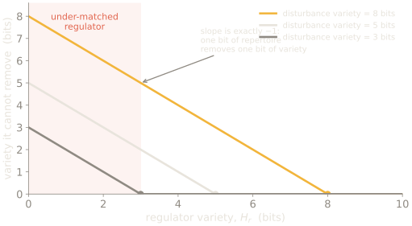
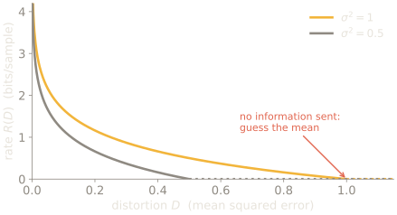
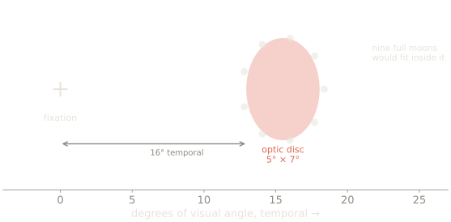
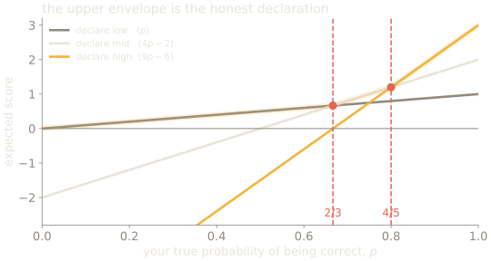

## Where this week sits

| Now | Part | Weeks | What it does |
| --- | --- | --- | --- |
| **→** | **Premise** | weeks 1–2 | the constraint, and what a sense organ is for |
|  | Interior models | weeks 3–7 | trace, association, map, prediction, self |
|  | Control group | weeks 8–10 | other minds, as the only outside vantage |
|  | The human case, and its limits | weeks 11–12 | the catalogue, and the blind spot |

The third part is not a tour. It is the only place a bound is visible from
outside, which is what the fourth part needs.

---

# How and Why You're Dumb

SLOP3233 · Week 1 · Halvard Emms

---

{/* _class: quote */}

You are a finite thing inside a world that is not.

---

{/* _class: impact */}

# Part 1 — the constraint, before any biology

---

## A system smaller than its world must throw things away

<figure class="fig">
<svg viewBox="0 0 520 190" role="img" aria-label="A large region labelled world states contains a much smaller region labelled states the system can distinguish; the difference is labelled discarded.">
  <ellipse cx="230" cy="95" rx="200" ry="80" class="d-line" />
  <text x="60" y="35" class="d-sm">world states</text>
  <circle cx="175" cy="100" r="42" class="d-accent" />
  <text x="175" y="100" text-anchor="middle" class="d-hi">held</text>
  <path d="M300 60 q40 35 0 70" class="d-warn" />
  <text x="360" y="60" class="d-warn-t">discarded</text>
  <text x="360" y="80" class="d-sm">not represented,</text>
  <text x="360" y="96" class="d-sm">and not flagged</text>
</svg>
<figcaption>The second line is the whole course. Nothing marks the boundary from inside.</figcaption>
</figure>

```notes
Do not say "blind spot" yet. That lands with the card, twenty minutes from now.
```

---

## Ashby, 1956: you cannot regulate what you cannot represent



**Requisite variety:** the number of distinct responses a regulator can make.
Ashby's law puts a floor on what it cannot absorb:

**H(outcome) ≥ H(disturbance) − H(regulator)**

---

## The slope is −1 by construction

One bit of repertoire removes one bit of variety, and not a fraction more.

---

## Worked, with numbers

A thermostat that can only switch a heater **on or off** has
H(regulator) = log₂ 2 = **1 bit**.

Suppose the disturbances it must counter — outdoor temperature, occupancy,
sunlight, draughts, door openings — jointly take 32 distinguishable states, so
H(disturbance) = log₂ 32 = **5 bits**.

```
H(outcome) ≥ 5 − 1 = 4 bits of variation it cannot remove
```

**Sanity check:** buy a regulator with 32 settings and the floor drops to
5 − 5 = 0. Buy one with 64 and it stays at 0 — extra repertoire past the
disturbance variety buys nothing.

---

## The moral

Ashby's law is not advice about thermostats.

It says the **shape of what a system cannot control is fixed by its own
repertoire**, and no cleverness in how the repertoire is deployed changes the
floor.

Every organism in this course is somewhere on that inequality.

---

## Read the left-hand region

A regulator with fewer distinguishable responses than the world has
distinguishable disturbances leaves the remainder standing —

**however cleverly it is organised.**

No amount of architecture substitutes for repertoire. That is what makes it a
law rather than a design guideline.

---

## Conant & Ashby, 1970: so the model is not optional

<div class="cols">
<figure class="fig">
<svg viewBox="0 0 260 180" role="img" aria-label="A regulator box contains a smaller box labelled model of system, with an arrow looping out to the system and back.">
  <rect x="14" y="30" width="120" height="110" class="d-box" />
  <text x="74" y="48" text-anchor="middle" class="d-sm">regulator</text>
  <rect x="34" y="66" width="80" height="54" class="d-accent" />
  <text x="74" y="86" text-anchor="middle" class="d-hi">model</text>
  <text x="74" y="104" text-anchor="middle" class="d-sm">of system</text>
  <rect x="170" y="56" width="76" height="60" class="d-box" />
  <text x="208" y="86" text-anchor="middle">system</text>
  <path d="M134 74 h36" class="d-line" />
  <path d="M170 106 h-36" class="d-line" />
</svg>
</figure>

<div>

Any successful regulator **contains a model** of what it regulates.

So only its accuracy is negotiable.

</div>
</div>

---

## Shannon gave us the price list



The exact closed form, not a sketch: **R(D) = ½·log₂(σ²/D)**.

Past D = σ² the rate is zero — you send nothing and guess the mean.

---

## Three results, one claim

| Year | Result | What it forbids |
| --- | --- | --- |
| 1948 | Rate–distortion (Shannon) | fidelity beyond your channel capacity |
| 1956 | Requisite variety (Ashby) | regulating variety you cannot represent |
| 1970 | Good regulator (Conant & Ashby) | regulating without a model at all |

None of the three is about biology. All three constrain it.

---

## Why start here rather than with an animal

Because the alternative is circular.

If you begin by asking "how intelligent is this organism", you have already
assumed intelligence is a quantity on a single scale, which is the assumption
week 8 destroys and week 12 turns on us.

Beginning with the constraint means the question becomes: **what did this system
decide not to represent, and what did that buy?**

That question has an answer for a bacterium and for you.

---

{/* _class: impact */}

# Take out your card

---

## The optic disc: no photoreceptors, no report



Roughly 15° temporal, about 5° × 7°. The full moon subtends half a degree.

---

## Which is to say

**Nine full moons of nothing**, in each eye, about fifteen degrees out from
wherever you are looking.

Present since birth. Never once reported.

---

## What you are about to watch is not the gap

<figure class="fig">
<svg viewBox="0 0 520 150" role="img" aria-label="Three panels: a dot at fifteen degrees from a fixation cross; the dot vanishing; and the region filled with surrounding pattern rather than showing a hole.">
  <g>
    <rect x="10" y="20" width="150" height="100" class="d-box" />
    <text x="30" y="46" class="d-lg">+</text>
    <circle cx="128" cy="70" r="7" class="d-fill-accent" />
    <text x="85" y="138" text-anchor="middle" class="d-sm">fixate the cross</text>
  </g>
  <g>
    <rect x="185" y="20" width="150" height="100" class="d-box" />
    <text x="205" y="46" class="d-lg">+</text>
    <circle cx="303" cy="70" r="7" class="d-warn" />
    <text x="260" y="138" text-anchor="middle" class="d-sm">move the card in</text>
  </g>
  <g>
    <rect x="360" y="20" width="150" height="100" class="d-box" />
    <text x="380" y="46" class="d-lg">+</text>
    <text x="435" y="138" text-anchor="middle" class="d-sm">the dot is gone</text>
  </g>
</svg>
<figcaption>Panel three has no hole in it. Your visual system generated the ground and did not tell you.</figcaption>
</figure>

---

{/* _class: quote */}

Not the gap. The filling.

---

## But be careful what you conclude from it

There is a real dispute here, and it is a good first taste of what this course
does with disputes.

**Ramachandran** and others describe the visual system as actively *filling in*
— generating plausible content across the gap, like an interpolation.

**Dennett** argues nothing is filled in. The system simply **does not represent
the absence**, and there is no need to paint anything, because nobody is
looking at an internal canvas.

---

## The two accounts predict differently

| Question | Filling-in | Not-representing-absence |
| --- | --- | --- |
| Is content generated? | yes | no |
| What would you find in cortex? | activity coding the interpolated pattern | nothing where the gap is |
| Why no hole is seen | the hole was painted over | there is no mechanism that reports holes |

Some V1 studies do find responses consistent with interpolation, which pushes
toward the first. Grade **[C]** — and notice that both accounts explain your
experience equally well, which is exactly why the experience cannot settle it.

```notes
This is the first time they see that introspection does not adjudicate between
two theories of introspection. Say so.
```

---

{/* _class: impact */}

# Part 3 — the instrument you use all semester

---

## The notation you will use every week

<figure class="fig">
<svg viewBox="0 0 560 200" role="img" aria-label="Decision flowchart: has it replicated, leading to established; does the field disagree, leading to contested; otherwise speculative.">
  <rect x="8" y="78" width="104" height="44" class="d-box" />
  <text x="60" y="100" text-anchor="middle">a claim</text>
  <path d="M112 100 h40" class="d-line" />
  <rect x="152" y="70" width="128" height="60" class="d-box" />
  <text x="216" y="90" text-anchor="middle" class="d-sm">replicated, or</text>
  <text x="216" y="110" text-anchor="middle" class="d-sm">uncontested?</text>
  <path d="M280 88 h48" class="d-accent" />
  <text x="336" y="88" class="d-hi">**[E]**</text>
  <path d="M216 130 v40 h112" class="d-line" />
  <rect x="328" y="146" width="128" height="48" class="d-box" />
  <text x="392" y="170" text-anchor="middle" class="d-sm">field disagrees?</text>
  <path d="M456 170 h34" class="d-accent" />
  <text x="498" y="170" class="d-hi">**[C]**</text>
  <path d="M392 146 v-24 h98" class="d-warn" />
  <text x="498" y="118" class="d-warn-t">**[S]**</text>
</svg>
<figcaption>Established, contested, speculative. By week 3 you assign these yourself.</figcaption>
</figure>

---

## Where **[C]** actually sits

| Grade | Not this | But this |
| --- | --- | --- |
| **[E]** | "true" | replicated, or nobody is arguing |
| **[C]** | "we don't know yet" | **the disagreement is the content** |
| **[S]** | "guessing" | reasoned past the evidence, and labelled |

```notes
The middle row is the one they get wrong all semester. **[C]** is not a shrug.
```

---

## Grade these before I tell you

1. *Octopuses have eight independent brains.*
2. *Ego depletion: self-control is a limited resource that runs down with use.*
3. *The mantis shrimp sees millions more colours than humans.*
4. *Slime moulds can navigate a maze.*

Write **[E]**, **[C]** or **[S]** beside each. Two minutes.

---

## The answers, and why they are uncomfortable

| Claim | Grade | Why |
| --- | --- | --- |
| 1 · eight brains | **[S]** | arms hold most neurons and act locally, but "brains" imports more than the evidence |
| 2 · ego depletion | **[C]** | 23 labs, N = 2,141, no effect — and still argued over |
| 3 · mantis shrimp colours | **[E]** that it is **false** | discrimination measured ~10× worse than a goldfish |
| 4 · slime mould maze | **[E]** | replicated, and the mechanism was identified by removing the cue |

---

## What that exercise was for

Three of those four are things you had probably heard. One of them is
confidently repeated and inverts its source.

**"Sounds right" and "is supported" are different properties of a sentence**,
and you cannot tell them apart by introspection — which is the first appearance
of week 12's problem, in week 1, about you.

```notes
Do not moralise here. Most of the room gets 2 of 4 and that is the point.
```

---

## Four claims. Two are wrong.

<figure class="fig">
<svg viewBox="0 0 480 130" role="img" aria-label="Four claim cards in a row, two marked with a tick and two with a cross, above a note that the field took decades to notice.">
  <g>
    <rect x="8" y="20" width="104" height="58" class="d-box" />
    <text x="60" y="49" text-anchor="middle" class="d-sm">claim 1</text>
    <rect x="128" y="20" width="104" height="58" class="d-box" />
    <text x="180" y="49" text-anchor="middle" class="d-sm">claim 2</text>
    <rect x="248" y="20" width="104" height="58" class="d-box" />
    <text x="300" y="49" text-anchor="middle" class="d-sm">claim 3</text>
    <rect x="368" y="20" width="104" height="58" class="d-box" />
    <text x="420" y="49" text-anchor="middle" class="d-sm">claim 4</text>
  </g>
  <text x="240" y="106" text-anchor="middle" class="d-sm">the field took decades to notice which</text>
</svg>
<figcaption>Nobody gets all four. Finding that out in week 1 is cheaper than in week 10.</figcaption>
</figure>

---

## Before next week, in this order

<figure class="fig">
<svg viewBox="0 0 500 120" role="img" aria-label="A two-step sequence: write the position statement first, then do the reading, with a crossed-out arrow showing the reverse order is wrong.">
  <rect x="14" y="34" width="180" height="52" class="d-accent" />
  <text x="104" y="52" text-anchor="middle" class="d-hi">1. position statement</text>
  <text x="104" y="72" text-anchor="middle" class="d-sm">~500 words, no reading</text>
  <path d="M200 60 h56" class="d-line" />
  <rect x="262" y="34" width="180" height="52" class="d-box" />
  <text x="352" y="60" text-anchor="middle">2. the week 2 reading</text>
  <path d="M262 100 h-56" class="d-warn" />
  <text x="352" y="104" text-anchor="middle" class="d-warn-t">not this way round</text>
</svg>
<figcaption>The only work in this course that is better for being uninformed. Hurdle: no statement, no revision mark.</figcaption>
</figure>

---

## What this course is not

- **Not a survey of clever animals.** Weeks 8–10 are a control group, and they exist to test whether the account generalises.
- **Not a ladder.** There is no scale with bacteria at one end and us at the other. *Scala naturae* is what evolutionary biology spent a century dismantling.
- **Not a list of your cognitive biases.** Week 11 is largely about why that literature is less secure than its popularity suggests.

---

## What is assessed, and when

| Piece | Weight | Due |
| --- | --- | --- |
| Position statement | hurdle, 0% | end of week 3 |
| News and Views investigation | 25% | week 7 |
| Revision and memo | 20% | week 11 |
| Calibrated quizzes | 15% | weekly, best 8 of 10 |
| Cognitive profile | 40% | week 12 |

Two of those are unusual enough to explain now.

---

## The quizzes will make your score look bad

They use **certainty-based marking**: you declare how sure you are, and a
confident error costs six marks where a hedged one costs nothing.

Students at 80% accuracy typically collect about half the available marks.

That gap is not a scoring quirk. It is the subject of week 12, arriving in week
2 and in your own results.

---

## The quiz scoring, worked

| Declared certainty | If correct | If wrong |
| --- | --- | --- |
| low | +1 | 0 |
| mid | +2 | −2 |
| high | +3 | −6 |

Let **p** be your true probability of being correct. Expected score is linear
in p:

```
E[low]  = 1p + 0(1−p) =      p
E[mid]  = 2p − 2(1−p) = 4p − 2
E[high] = 3p − 6(1−p) = 9p − 6
```

---

## Where the advice changes

Set the lines equal:

```
low = mid    →   p = 4p − 2    →   p = 2/3  ≈ 0.667
mid = high   →   4p − 2 = 9p − 6   →   p = 4/5 = 0.800
```

**Sanity check:** those are the 67% and 80% thresholds the scheme publishes.
They were not chosen by anyone. They fall out of the payoff table.

---

## Which is what "proper" means



The highest line at your actual **p** is always the one that reports your actual
**p**. No misreport beats honesty.

---

## The moral

You cannot improve your score by managing how confident you look.

The only lever is **being better calibrated** — which is the one thing the
course is trying to teach, and the reason the scheme was chosen over ordinary
negative marking.

---

## And the position statement is deliberately uninformed

~500 words, before you do any reading, on what you currently think intelligence
is and where it starts.

**Not marked.** Submitting it is a hurdle. It cannot be extended past week 3,
because a statement written in week 8 has already been contaminated by the
thing it is meant to predate.

In week 11 you revise it, and the **memo** explaining what moved is what earns
the marks.

---

{/* _class: centered */}

## Week 12 asks this again

The card found a gap your visual system never reported.

The last week asks what else is shaped like that, and has no card.
