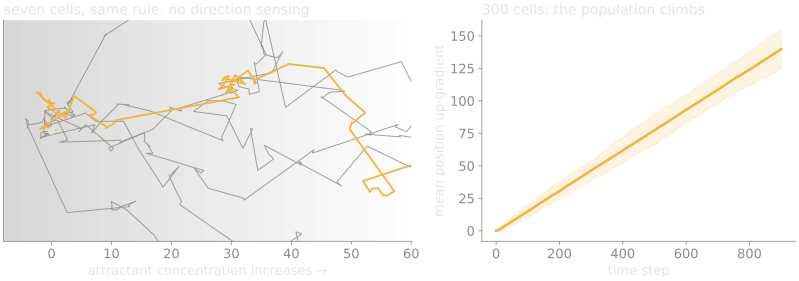
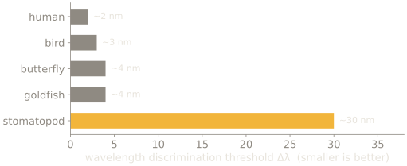

## Recall the end of week 1

A finite system must discard most of its world, and the discarding is not reported. We found one instance with a card.

> **The question we left open**
>
> Is that a fact about eyes, or about any system that has to sense at all?

---

## Where this week sits

| Now | Part | Weeks | What it does |
| --- | --- | --- | --- |
| **→** | **Premise** | weeks 1–2 | the constraint, and what a sense organ is for |
|  | Interior models | weeks 3–7 | trace, association, map, prediction, self |
|  | Control group | weeks 8–10 | other minds, as the only outside vantage |
|  | The human case, and its limits | weeks 11–12 | the catalogue, and the blind spot |

The third part is not a tour. It is the only place a bound is visible from
outside, which is what the fourth part needs.

---

# What a sense organ is for

SLOP3233 · Week 2 · Rosalind Achebe

---

{/* _class: impact */}

# Part 1 — sensing with nothing held

---

## A bacterium solves this with one number



The entire decision rule: **if things are improving, keep going; otherwise turn
at random.**

---

## What is and is not in that rule

| Not present | Present |
| --- | --- |
| a direction to the food | receptor occupancy now |
| a representation of the target | occupancy a few seconds ago |
| a map, a plan, a goal | two motor states |

It climbs a gradient with no ability to sense which way the gradient points.

```notes
Simulated with tumble probability 0.35 when worsening, 0.06 when improving.
Three hundred cells reach a mean displacement of ~140 units in 900 steps.
```

---

{/* _class: quote */}

It does not know where the food is. It knows whether things are getting better.

---

## Watch your verbs

| You want to write | It licenses | What is actually held |
| --- | --- | --- |
| "seeks", "searches for" | a goal | — |
| "senses the gradient" | a spatial quantity | — |
| "compares" | two stored values | **one recent value, and a sign of change** |

```notes
Spend real time here. Every projection students make later starts in this table.
```

---

## Where the memory actually is

The comparison needs a stored past, and in *E. coli* it is **receptor
methylation**.

Ligand binding drives a fast response; methylation state adapts on a slower
timescale, restoring the baseline. The difference between the two timescales
*is* the memory — a few seconds of it.

So "is it getting better?" is implemented as "does current occupancy exceed
what the methylation state has adapted to?"

---

## Which is worth dwelling on

The memory is not a record. It is an **adaptation offset**, a moving baseline
that the current signal is compared against.

Nothing stores a value. Nothing is retrieved. And it is enough.

Macnab & Koshland, *PNAS* 69(9), 2509–2512 (1972); Berg, *E. coli in Motion*
(2004).

---

## The numbers, because they constrain the story

| Quantity | Value |
| --- | --- |
| Swimming speed | ~20–30 body lengths per second |
| Run duration | ~1 second |
| Tumble duration | ~0.1 second |
| Adaptation timescale | seconds |
| Detectable change in occupancy | a few percent |

A cell that reorients every second cannot be using a spatial comparison across
its own body — it is far too small and too fast. **Temporal** comparison is the
only option its physics leaves open.

---

## Von Uexküll's term for this

The **Umwelt**: not the environment, but the world *as it exists for that
organism*, built entirely from the distinctions its receptors can make.

His example is a tick, whose world reduces to butyric acid, warmth, and hair.
Not an impoverished version of our world. A different one, complete in itself.

*A Foray into the Worlds of Animals and Humans* (1934).

---

## So the question changes shape

Not "how much of the world does this organism perceive?"

But **"which distinctions did it commit to paying for?"**

That reframing is what makes the next animal comprehensible rather than absurd.

---

{/* _class: impact */}

# Now the useful animal

---

## Twelve channels against your three


Gaussian approximations at published peak positions — for channel shape and
spacing, not digitised microspectrophotometry.

---

## Why channel shape decides what you can resolve

Colour discrimination in us works by **comparing across channels**. Broad,
overlapping sensitivities mean a small wavelength shift changes the ratio
between two channels measurably.

Narrow, barely-overlapping channels give you excellent *identification* of
which band a wavelength fell in, and almost no information about where inside
the band it fell.

---

## Discrimination, measured



Thoen et al., *Science* 343(6169), 411–413 (2014). Bars are indicative of the
reported ten-fold ratio rather than digitised values.

---

{/* _class: quote */}

The popular claim does not overstate the finding. It inverts it.

---

## Two ways to use twelve channels

<figure class="fig">
<svg viewBox="0 0 540 200" role="img" aria-label="Left: opponent processing compares channel pairs to compute a continuous hue. Right: labelled-bin processing reports which single channel fired hardest, giving a discrete category.">
  <text x="10" y="16" class="d-sm">compute a hue (what we do)</text>
  <g>
    <rect x="14" y="32" width="26" height="40" class="d-box" />
    <rect x="48" y="32" width="26" height="40" class="d-box" />
    <rect x="82" y="32" width="26" height="40" class="d-box" />
    <path d="M60 78 v18 h-6" class="d-line" />
    <rect x="14" y="100" width="94" height="30" class="d-accent" />
    <text x="61" y="115" text-anchor="middle" class="d-sm">compare pairs</text>
    <path d="M61 134 v16" class="d-line" />
    <text x="61" y="166" text-anchor="middle" class="d-hi">continuous hue</text>
    <text x="61" y="186" text-anchor="middle" class="d-sm">slow, precise</text>
  </g>
  <line x1="250" y1="24" x2="250" y2="176" class="d-muted" />
  <text x="290" y="16" class="d-sm">read the loudest bin (the proposal)</text>
  <g>
    <rect x="294" y="32" width="18" height="40" class="d-box" />
    <rect x="318" y="32" width="18" height="40" class="d-box" />
    <rect x="342" y="26" width="18" height="46" class="d-fill-accent" />
    <rect x="366" y="32" width="18" height="40" class="d-box" />
    <rect x="390" y="32" width="18" height="40" class="d-box" />
    <rect x="414" y="32" width="18" height="40" class="d-box" />
    <path d="M351 80 v24" class="d-accent" />
    <text x="363" y="124" text-anchor="middle" class="d-hi">bin 3</text>
    <text x="363" y="152" text-anchor="middle" class="d-sm">no comparison,</text>
    <text x="363" y="168" text-anchor="middle" class="d-sm">no intermediate values</text>
  </g>
</svg>
<figcaption>Recognition rather than discrimination. Closer to a barcode scanner than an eye.</figcaption>
</figure>

---

## Why you would build that

<div class="cols">
<figure class="fig">
<svg viewBox="0 0 250 160" role="img" aria-label="A timeline of a mantis shrimp strike lasting a few milliseconds, with the window for colour identification marked at the start.">
  <line x1="20" y1="90" x2="230" y2="90" class="d-line" />
  <rect x="20" y="66" width="34" height="48" class="d-fill-accent" />
  <text x="37" y="132" text-anchor="middle" class="d-hi">identify</text>
  <path d="M60 90 h150" class="d-accent" />
  <circle cx="212" cy="90" r="7" class="d-warn" />
  <text x="140" y="66" text-anchor="middle" class="d-sm">strike, committed</text>
  <text x="140" y="140" text-anchor="middle" class="d-sm">milliseconds, irreversible</text>
</svg>
</figure>

<div>

Prey or mate, decided before a strike you cannot recall.

*That*, not *which*.

Mechanism still unresolved — a 2021 review says so. **[C]**

</div>
</div>

---

## The thing they can do that we cannot

Stomatopods are sensitive to **polarisation**, including *circular*
polarisation, the only animals known to be.

Which is the same story from the other side: the channels they built are
excellent for a distinction we cannot make at all, and poor for one we make
easily.

Neither system is better. They are priced differently.

---

## A case where nobody knows the answer

**Magnetoreception.** Many animals demonstrably use the geomagnetic field to
navigate. Two candidate mechanisms have been argued for decades:

| Mechanism | Idea | Problem |
| --- | --- | --- |
| Radical pair | light-dependent quantum effect in cryptochrome | hard to demonstrate *in vivo* |
| Magnetite | ferrous particles acting as a compass needle | receptor cells not conclusively identified |

A sense we are certain exists and cannot explain. **[C]**, and a useful
reminder that this course's confidence varies by topic.

---

## What would falsify the barcode account?

Worth asking, because this is the first **[C]** claim you are asked to hold.

- Behavioural discrimination that is *fine* within a single receptor band would break it — the account predicts you cannot resolve inside a bin
- Neural evidence of opponent comparison between adjacent channels would break it
- A species with the same twelve channels and *good* discrimination would break it

None of those has been shown either way, which is what **[C]** means here.

---

## The lesson that carries to week 7

<figure class="fig">
<svg viewBox="0 0 500 130" role="img" aria-label="An arrow from more sensors to better sensing, crossed out, replaced by an arrow from a sensory system to a commitment about which distinctions are worth paying for.">
  <text x="20" y="36" class="d-sm">more sensors</text>
  <path d="M120 32 h70" class="d-warn" />
  <text x="200" y="36" class="d-sm">better sensing</text>
  <line x1="118" y1="46" x2="192" y2="18" class="d-warn" />
  <rect x="20" y="70" width="460" height="44" class="d-accent" />
  <text x="250" y="92" text-anchor="middle" class="d-hi">a sensory system is a commitment about which distinctions are worth paying for</text>
</svg>
</figure>

---

## This is a News and Views claim

A popular statement that **inverts** its source is exactly the shape your week
7 investigation is looking for.

And note the trap in the brief: a popular version that is merely *less
detailed* is not wrong, and a thousand words discovering that journalists
simplify has found nothing.

The mantis shrimp is not available, it is the worked example.

---

{/* _class: impact */}

# Part 3 — what a sensory system commits to

---

## Three Umwelten, priced differently

| Organism | Commits to | Pays with |
| --- | --- | --- |
| Tick | butyric acid, warmth, hair texture | no vision, no navigation, years of waiting |
| *E. coli* | one scalar, compared over seconds | no spatial sense of anything |
| Stomatopod | twelve spectral bins, polarisation, speed | ~10× worse hue discrimination |

None of the three rows is a deficient version of another. Each is a budget
spent.

---

## Which is the question to carry into week 3

Not *how much* does this organism perceive.

**What did it commit to paying for, and what did that purchase cost it?**

Every remaining week of the course is a version of that question, including the
weeks about you.

---

{/* _class: centered */}

## Seminar

Does the 2014 result license *"the mantis shrimp has poor colour vision"*?

Not quite. Work out why.
