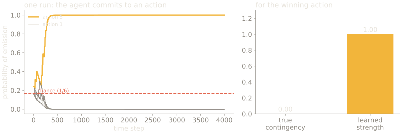
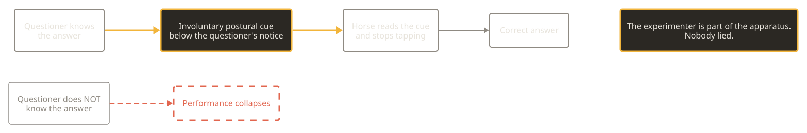

## Recall the end of week 3

Memory can sit outside the organism, and a single cell can escalate through an ordered hierarchy. A trace cannot distinguish what caused it.

> **The question we left open**
>
> Does linking two events together do any better?

---

## Where this week sits

| Now | Part | Weeks | What it does |
| --- | --- | --- | --- |
|  | Premise | weeks 1–2 | the constraint, and what a sense organ is for |
| **→** | **Interior models** | weeks 3–7 | trace, association, map, prediction, self |
|  | Control group | weeks 8–10 | other minds, as the only outside vantage |
|  | The human case, and its limits | weeks 11–12 | the catalogue, and the blind spot |

The third part is not a tour. It is the only place a bound is visible from
outside, which is what the fourth part needs.

---

# Correlation, standing in for cause

SLOP3233 · Week 4

Rosalind Achebe

---

{/* _class: impact */}

# Part 1 — what linking two events buys

---

## The capability

Link two events, so that one predicts the other.

Now the system can learn.

---

## The cost, in the same breath

It has access to **co-occurrence**.

It has no access to **causal structure**.

---

{/* _class: quote */}

Nothing inside the mechanism distinguishes a real dependency from a coincidence that happens to be reliable.

---

## Skinner, 1948

Pigeons. Food hopper on a fixed timer.

Elaborate stereotyped routines acquired — turning, head-thrusting, pendulum
swings.

---

## From the pigeon's position

The routine was working.

The food kept arriving.

---

## So superstition is not a bug

It is what the mechanism does when running **correctly** on input that happens
to be misleading.

Hold that distinction. It returns in week 11 about us.

---

## Say it formally

The contingency between action and outcome is not co-occurrence. It is a
*difference*:

```
ΔP = P(outcome | action) − P(outcome | no action)
```

On a fixed-interval schedule, food arrives on a timer. So both terms are equal
and **ΔP = 0**, exactly, for every action the animal could make.

---

## And yet



Simulated agent with access to co-occurrence only. Reward on a fixed interval,
unaffected by anything it does.

---

## Why it happens, mechanically

Whichever action happens to be **in progress** when the timer fires gains
strength.

Gaining strength means being emitted more often. Being emitted more often means
being more likely to be in progress next time.

**Positive feedback on a coincidence.** The winner reaches near-certainty at a
true contingency of exactly zero.

---

## So superstition is not a bug

It is what the mechanism does when running correctly on input that happens to
be misleading.

Skinner (1948) reported exactly this in pigeons: turning, head-thrusting,
pendulum motions, elaborate, stereotyped, and from the bird's position,
working.

---

## But the mechanism is cleverer than pure contiguity

Here is the refinement, and it is the reason associative learning is a serious
theory rather than a caricature.

**Rescorla & Wagner (1972)**: learning is driven not by co-occurrence but by
**prediction error** — how surprising the outcome was given everything already
predicting it.

```
ΔV = αβ(λ − ΣV)
```

---

## Work the model on one cue

Take **α β = 0.3**, **λ = 1** (shock present), starting from **V = 0**.

```
trial 1:  ΔV = 0.3 × (1 − 0.00) = 0.30   →  V = 0.30
trial 2:  ΔV = 0.3 × (1 − 0.30) = 0.21   →  V = 0.51
trial 3:  ΔV = 0.3 × (1 − 0.51) = 0.147  →  V = 0.66
trial 4:  ΔV = 0.3 × (1 − 0.66) = 0.102  →  V = 0.76
```

**Sanity check:** the increments shrink and V approaches λ = 1 without
exceeding it. Learning slows as the outcome stops being surprising.

---

## Now add a second cue to a trained one

Cue A is already at **V_A = 0.95**. Introduce cue B alongside it, so the model
uses **ΣV = V_A + V_B**.

```
V_A = 0.95, V_B = 0.00   →  ΣV = 0.95

ΔV_B = 0.3 × (1 − 0.95) = 0.015
```

B gains **0.015** per trial instead of 0.30. Twenty times slower, from the
identical pairing.

---

## The moral

Blocking is not an extra assumption bolted onto the theory to fit the data.

It is **arithmetic**: the error term is already near zero, so there is nothing
left to drive learning about B.

A mechanism that learns from surprise will be blind to a perfectly valid cue
that arrives second.

---

## Which predicts blocking, and blocking happens

**Kamin's design:**

| Phase | Training | Result |
| --- | --- | --- |
| 1 | cue A → shock | A becomes predictive |
| 2 | A **and** B together → shock | B learns almost nothing |

B co-occurs with the shock perfectly. On a contiguity account it should be
learned. It is not, because A already predicted the shock, so there was no
error left to drive learning.

---

## Note what that means for this course

The mechanism tracks **unexplained variance**, not co-occurrence.

Which is a prediction-error account in 1972, twenty-six years before week 6's
literature, in a rat.

```notes
Point forward explicitly. Students otherwise treat week 6 as arriving from
nowhere.
```

---

## And it still cannot solve the original problem

Prediction error tells you *that* something was unexplained. It does not tell
you **why**, and it has no access to whether the relationship is causal.

A reliable coincidence generates exactly the same error signal as a cause.

---

{/* _class: impact */}

# Part 2 — and what it cannot buy

---

## Two more properties worth having

**Extinction.** Stop pairing, and the association weakens — but not by erasure.

**Spontaneous recovery.** After extinction, time passes and the response
returns. Which means the original learning was never deleted, only suppressed
by newer learning.

So the system accumulates competing predictions rather than overwriting them —
and cannot tell you which one it is currently running on.

---

## Humans do this too, and know they are doing it

Langer's **illusion of control** (1975): people bet more, and report more
confidence, when irrelevant features of a chance task resemble a skill task —
choosing their own lottery ticket, competing against a nervous opponent.

Gamblers' rituals are Skinner's pigeons with a vocabulary.

---

## But there is something we can do that pure association cannot

**Intervene.**

Observing that A precedes B is compatible with A causing B, B causing A, or a
common cause. **Acting** on A — setting it rather than seeing it — breaks that
symmetry, because an intervention has no cause inside the system.

---

## Which is a genuinely different capacity

| Route to the claim | Available from | Distinguishes cause? |
| --- | --- | --- |
| Seeing A then B | association | **no** |
| Setting A yourself | acting on the world | **yes** |

Gopnik and colleagues' work on causal learning in children turns on exactly
this: children who can intervene learn causal structure that observation alone
underdetermines.

---

## Note what that costs

Intervention is expensive, slow, and often impossible, you cannot intervene on
the climate, the economy, or your own upbringing.

So the cheap mechanism is the one running most of the time, and the expensive
one is reserved. That trade is the shape of week 11.

---

{/* _class: impact */}

# A horse

---

## Clever Hans

Arithmetic. Tapping answers with a hoof.

Correct far more often than chance.

---

## Pfungst, 1911

The horse was genuinely reading something.

It was reading **the questioner**.

---

## The chain, and the part that matters



Pfungst tested it by removing exactly one thing: whether the questioner knew
the answer.

---

## Nobody was lying

Von Osten believed it. The questioners believed it.

The cue was involuntary and below their own notice.

---

{/* _class: quote */}

The experimenter is part of the apparatus.

---

## Everything downstream descends from this

- blinded scoring
- preregistration
- adversarial collaboration (week 12)

Markel's blinding in the pea plant study is not a technicality. It is this.

---

{/* _class: centered */}

## Seminar

Three published results. Design the Clever Hans objection to each.

Two of them have one.
