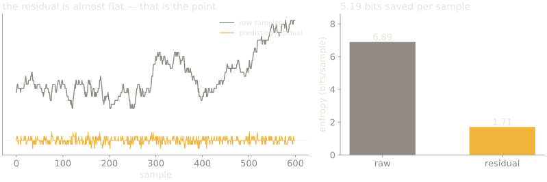
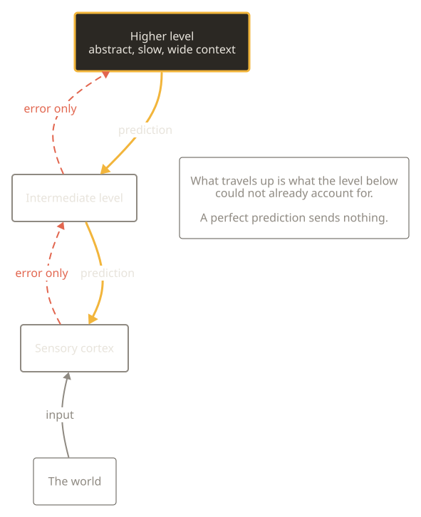

## Recall the end of week 5

A map lets you act on what you are not touching. It distorts in predictable directions, and reports nothing about its own deformation.

> **The question we left open**
>
> Where does the content of a representation actually come from?

---

## Where this week sits

| Now | Part | Weeks | What it does |
| --- | --- | --- | --- |
|  | Premise | weeks 1–2 | the constraint, and what a sense organ is for |
| **→** | **Interior models** | weeks 3–7 | trace, association, map, prediction, self |
|  | Control group | weeks 8–10 | other minds, as the only outside vantage |
|  | The human case, and its limits | weeks 11–12 | the catalogue, and the blind spot |

The third part is not a tour. It is the only place a bound is visible from
outside, which is what the fourth part needs.

---

# Perception as construction

SLOP3233 · Week 6 · Tuyet Nabarro

---

## Five weeks pointed one way

**world → sense organ → representation**

Measurement, then valuation, then a trace, then association, then a map.

Each week added something that made the inward journey richer.

---

{/* _class: impact */}

# Today it reverses

---

## The claim

The system **generates** what it expects.

Only the **mismatch** travels up.

What you experience is mostly manufactured internally and checked against
input, rather than delivered by it.

```notes
Do not soften this. The destabilising version is the accurate one.
```

---

## Three things that get conflated

| Term | What it is | Scope |
| --- | --- | --- |
| Predictive **coding** | a specific proposal about neural implementation | narrow, testable |
| Predictive **processing** | a framework for perception and action | broad |
| The **free energy principle** | a mathematical claim about self-organising systems | very wide |

Published work runs these together constantly. Keeping them apart is most of
what it takes to read this literature carefully.

---

## Who to attribute what to

**Rao & Ballard, 1999** — predictive coding in visual cortex. The
implementation-level proposal.

**Clark, 2013** — *"Whatever next?"*, *Behavioral and Brain Sciences* 36(3),
181–204. The framework, stated for a general audience. Your reading.

**Friston, 2010**, the free energy principle, *Nature Reviews Neuroscience*
11(2), 127–138. The ambitious unification.

---

{/* _class: impact */}

# Part 1 — why a system would do this

---

## Because the channel is narrow

The optic nerve is a **bottleneck**, not a cable.

Roughly 10⁸ photoreceptors feed roughly 10⁶ ganglion cell axons. Two orders of
magnitude of compression before the signal has left the eye.

Whatever leaves has already been thrown away. The question is only what
principle governed the throwing.

---

## Barlow's answer, 1961

**Efficient coding.** A sensory system should recode its input to remove
redundancy, because redundancy is capacity spent on what the receiver could
have worked out.

Natural scenes are enormously redundant: neighbouring points are correlated,
so most of each sample is predictable from its neighbours.

---

## So measure the saving



Simulated signal with the 1/f² power spectrum measured in natural scenes
(Field 1987; Ruderman & Bialek 1994), quantised to 256 levels.

---

## The number

**6.89 bits per sample raw. 1.71 bits as residuals.**

A **75% saving**, from a predictor of almost no sophistication — it simply
assumes the next sample resembles the last.

That is the efficiency argument, computed rather than asserted.

---

## And the architecture that follows



The asymmetry is the claim. A level that predicts its input perfectly is
**silent**.

---

{/* _class: impact */}

# Part 2 — what it explains

---

## Illusions stop being a list

On a passive view, an illusion is a malfunction, a place where the machinery
breaks.

On this view an illusion is the machinery **working**, on input engineered to
make a normally-good inference come out wrong.

That reclassification is the framework's strongest asset.

---

## Constructed, not reproduced


Independent implementation of Adelson's checker-shadow effect — our pixel
values, not his figure.

---

## The values are exact, not approximate

```
rendered luminance = reflectance × illumination

  dark check, full light :  0.50 × 1.0000  = 0.5000
  light check, in shadow :  0.90 × 0.5556  = 0.5000
```

**A = 0.5000. B = 0.5000.** The script asserts it rather than claiming it.

---

## And knowing does not help

You have now seen the proof. Look at the left panel again.

The inference runs **below the level at which knowing operates**, so
propositional knowledge has no purchase on it.

```notes
Let them try. Someone always insists they can see it correctly now.
```

---

## Evidence of the same shape

- **Binocular rivalry**, conflicting input to each eye produces alternation, not a blend. The system commits to a hypothesis, then switches.
- **Bistable figures** — Necker cube, Rubin vase. One stimulus, two stable interpretations, no intermediate.
- **The hollow mask** — a concave face is seen as convex, because faces are convex and the prior is overwhelming.
- **Change blindness**, large changes across a disruption go unnoticed (Rensink, O'Regan & Clark, 1997).
- **Inattentional blindness** — Simons & Chabris's gorilla, 1999.

---

## What unifies that list

In every case the system's **prior** wins over the input.

And in every case the observer has no sense of a contest having taken place.
The output arrives as perception, not as a conclusion.

---

{/* _class: impact */}

# Part 3 — the extensions

---

## Attention as precision

**Precision**, in this literature, is the inverse variance assigned to a
prediction error: how much weight a given mismatch is allowed to carry.

Attention, on this account, isn't a spotlight that brightens a region.

It's the **weighting** applied to prediction error — how much a given mismatch
is allowed to revise the model.

Which makes attention a parameter of inference rather than a separate faculty.

---

## Interoception, and emotion as inference

Seth's extension: the same machinery applied **inward**.

Predictions about the state of the body, errors from the viscera, and emotion
as the inferred cause of an interoceptive pattern.

*Being You* (2021) is the accessible statement. Grade the strong version
**[C]**, it is a research programme, not a settled result.

---

## Hallucination as precision failure

If perception is inference under precision weighting, then perception can fail
in a specific way: **priors weighted too strongly relative to input**.

That gives a principled account of why hallucination is perceptual rather than
cognitive, and why it is not corrigible by argument.

Plausible, generative, and not established. **[C]**

---

{/* _class: impact */}

# Part 4 — now the objections

---

## You are required to arrive with one

A framework that accommodates every result is in an awkward position, not a
strong one.

This section is not balance for its own sake. It's the part of the week you
will be assessed on.

---

## The dark room problem

If a system acts to minimise prediction error —

why not find a featureless dark room, stop moving, and predict perfectly
forever?

---

## The standard reply, and why it is contested

The reply invokes **expected** free energy: agents minimise error anticipated
over future policies, which makes novelty-seeking and exploration fall out of
the same principle.

Sun & Firestone press on whether that reply is doing real work, or whether the
free parameters are absorbing the counterexample after the fact.

---

## Litwin & Miłkowski: unification by fiat

The sharper methodological charge.

The framework's apparent unifying power may come from **redescribing**
phenomena in its own vocabulary rather than explaining them — in which case
the unification is verbal, and the arrested development is the symptom.

---

## Colombo & Wright: is it testable?

If every result is accommodated, what observation would count against it?

Ask that about the free energy principle specifically. Then ask it about
predictive coding, where the answer is much better — Rao & Ballard's proposal
makes concrete claims about cortical microcircuitry that can fail.

---

## Which is why the three-way distinction mattered

| Level of claim | Falsifiable? |
| --- | --- |
| Predictive **coding** | yes — specific circuit-level predictions |
| Predictive **processing** | partly — depends on the formulation |
| Free energy principle | **disputed** |

Grading the whole bundle at once is the mistake. Grade the levels separately.

---

{/* _class: impact */}

# Part 5 — what this does to the course

---

## The consequence nobody likes

Nothing tags which parts of your experience were **sensed** and which were
**generated**.

There is no marker, no felt difference, no route to the distinction from the
inside.

---

{/* _class: quote */}

You do not perceive the world. You perceive your best current hypothesis about it, corrected occasionally.

---

## Two weeks ago, in an ant

The path integrator had no independent reference against which to check its
own output.

This week, the same structure, in you, the system generating the hypothesis
is the system evaluating it.

Week 12 is where that stops being a curiosity.

---

## Where we go next

If perception is a model, and the model includes the body —

it can include the **modeller**.

That is week 7, and it is where introspection stops being a reliable
instrument.

---

{/* _class: centered */}

## For the seminar

Bring one objection to the free energy principle,

and one observation that would move it.
