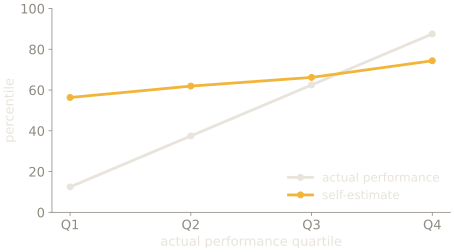
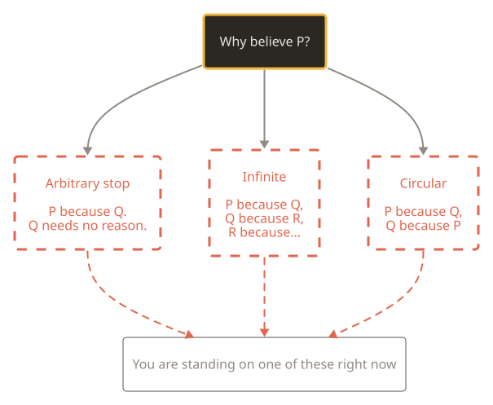

## Where this week sits

| Now | Part | Weeks | What it does |
| --- | --- | --- | --- |
|  | Premise | weeks 1–2 | the constraint, and what a sense organ is for |
|  | Interior models | weeks 3–7 | trace, association, map, prediction, self |
|  | Control group | weeks 8–10 | other minds, as the only outside vantage |
| **→** | **The human case, and its limits** | weeks 11–12 | the catalogue, and the blind spot |

The third part is not a tour. It is the only place a bound is visible from
outside, which is what the fourth part needs.

---

# The blind spot

SLOP3233 · Week 12 · Halvard Emms

---

## Nothing new today

<figure class="fig">
<svg viewBox="0 0 520 120" role="img" aria-label="Eleven small blocks representing weeks one to eleven, all feeding arrows into a single block labelled us.">
  <g class="d-muted">
    <rect x="8" y="20" width="26" height="30" /><rect x="40" y="20" width="26" height="30" />
    <rect x="72" y="20" width="26" height="30" /><rect x="104" y="20" width="26" height="30" />
    <rect x="136" y="20" width="26" height="30" /><rect x="168" y="20" width="26" height="30" />
    <rect x="200" y="20" width="26" height="30" /><rect x="232" y="20" width="26" height="30" />
    <rect x="264" y="20" width="26" height="30" /><rect x="296" y="20" width="26" height="30" />
    <rect x="328" y="20" width="26" height="30" />
  </g>
  <text x="8" y="66" class="d-sm">weeks 1–11</text>
  <path d="M180 78 v14 h180" class="d-accent" />
  <rect x="384" y="72" width="128" height="40" class="d-accent" />
  <text x="448" y="93" text-anchor="middle" class="d-hi">aimed at us</text>
</svg>
<figcaption>Everything is already on the table. The job is to point it somewhere.</figcaption>
</figure>

---

{/* _class: impact */}

# Dunning–Kruger

---

## What you expect this week to be

The bottom quartile overrates itself enormously. The top underrates slightly.

A metacognitive deficit, apparently.

---

## Krueger & Mueller, 2002: build it from nothing

Simulated: r = 0.30, mean estimate at the 66th percentile, n = 2000, seeded.

**Nothing in that model knows anything about competence-to-judge.** Q1 still
"overrates" itself by 44 points.

---

## The exchange, unresolved

| Year | Who | Claim |
| --- | --- | --- |
| 1999 | Kruger & Dunning | the unskilled are unaware |
| 2002 | Krueger & Mueller | regression + BTA predict the pattern |
| 2002 | Kruger & Dunning, reply | unreliable tests, bad mediators |
| 2006 | Burson, Larrick & Klayman | task difficulty drives miscalibration |

**[C]** — the effect that survives is real, weaker, and differently shaped.

---

{/* _class: quote */}

The most famous claim about not knowing what you don't know is itself not fully known.

---

## That is the right week 12 for this course

<figure class="fig">
<svg viewBox="0 0 480 120" role="img" aria-label="A loop from the course's subject to the course's own literature and back, labelled no exterior.">
  <rect x="14" y="40" width="150" height="46" class="d-box" />
  <text x="89" y="63" text-anchor="middle" class="d-sm">claims about error</text>
  <path d="M164 52 h110" class="d-accent" />
  <rect x="274" y="40" width="190" height="46" class="d-accent" />
  <text x="369" y="63" text-anchor="middle" class="d-hi">are subject to error</text>
  <path d="M369 86 v18 h-280 v-18" class="d-warn" />
  <text x="229" y="116" text-anchor="middle" class="d-warn-t">and there is no exterior</text>
</svg>
</figure>

---

{/* _class: impact */}

# The formal shape

---

## Nothing tests alone

<figure class="fig">
<svg viewBox="0 0 520 190" role="img" aria-label="One observation connects to a bundle containing a hypothesis plus auxiliary assumptions about instruments, background theory and initial conditions; a failed prediction cannot say which element is at fault.">
  <circle cx="70" cy="96" r="34" class="d-accent" />
  <text x="70" y="96" text-anchor="middle" class="d-hi">obs.</text>
  <path d="M104 96 h56" class="d-line" />
  <rect x="160" y="26" width="220" height="140" class="d-box" />
  <text x="270" y="46" text-anchor="middle" class="d-sm">the bundle under test</text>
  <g class="d-muted">
    <rect x="178" y="60" width="184" height="24" /><rect x="178" y="92" width="184" height="24" />
    <rect x="178" y="124" width="184" height="24" />
  </g>
  <text x="270" y="72" text-anchor="middle" class="d-sm">hypothesis</text>
  <text x="270" y="104" text-anchor="middle" class="d-sm">instrument assumptions</text>
  <text x="270" y="136" text-anchor="middle" class="d-sm">background theory</text>
  <path d="M380 96 h50" class="d-warn" />
  <text x="440" y="86" class="d-warn-t">fails —</text>
  <text x="440" y="106" class="d-sm">but which one?</text>
</svg>
<figcaption>Duhem, sharpened by Quine, 1951. Read Laudan &amp; Leplin against it, our own rules require the counterargument.</figcaption>
</figure>

---

## Underdetermination, drawn

**Underdetermination:** the available evidence is compatible with more than one
hypothesis, so observation alone cannot select between them.

---

## Why this is not scepticism

It does not follow that theory choice is arbitrary.

It follows that a **single** failed prediction cannot locate the fault — which
is why science proceeds by accumulating constraints across many tests rather
than by decisive refutation of one hypothesis at a time.

Laudan & Leplin argue the thesis is far weaker than its popular statement, and
our own rules require you to read them.

---

## Hume, and then the sharper version

**Hume's problem**: no number of observed instances entails the next one.
Induction cannot be justified deductively, and justifying it inductively is
circular.

**Goodman's new riddle** is worse, and more useful to us.

---

## Grue

Define *grue*: examined before time **t** and green, or examined after **t**
and blue.

Every observation of a green emerald so far confirms "all emeralds are green"
**and** "all emeralds are grue" equally well.

---

## Why that is the deeper problem

Hume says the evidence is insufficient. Goodman says the evidence **never
uniquely fixes a hypothesis at all**, you need a prior commitment about which
predicates are projectible before evidence can do any work.

Which is to say: **the bias has to come first**, and no amount of data supplies
it. Hold that for the No Free Lunch slide.

---

## Agrippa's trilemma

Via Sextus, *Outlines of Pyrrhonism* I.164–169. Pick a horn and defend it.

---

## No Free Lunch: the bias is not optional

Exhaustive, not sampled: all 256 target functions, trained on the same 4 points.
All three means are **exactly 0.500000**.

---

## Neurath's boat

> We are like sailors who have to rebuild their ship on the open sea, never
> able to dismantle it in dry dock and reconstruct it from the best materials.

Which is the constructive reading of Agrippa. You cannot inspect your
foundations from outside, and you can still replace a plank at a time.

---

## Two warnings before you use any of this

**Do not reach for Gödel.** Lucas and Penrose argued from the incompleteness
theorems to the non-computational nature of mind, and the argument is
near-universally rejected. Gödel constrains formal systems; the leap requires
premises about human mathematical ability that were never established.

A marker who knows this spots it instantly. **[E]** that the arguments fail.

---

## And do not overstate Kuhn

*The Structure of Scientific Revolutions* (1962) is not the claim that theory
choice is irrational or that paradigms are incommensurable in a way that makes
comparison impossible.

Kuhn spent much of his later career resisting exactly that reading. Cite him
for the observation that normal science is puzzle-solving inside assumptions —
not for licence to say anything goes.

---

## One formal constraint worth knowing

The **tractable cognition thesis** (van Rooij): a theory of cognition should
posit only computations that are feasible for the system in question.

Which rules out a great deal of otherwise elegant theory — including several
accounts of rationality that require intractable optimisation, and which week
11's bounded-rationality literature was reacting to all along.

---

{/* _class: impact */}

# Fallibilism is not relativism

---

## I will be strict about this

<figure class="fig">
<svg viewBox="0 0 520 170" role="img" aria-label="Left: four models at the same height, labelled all equal and marked wrong. Right: the same four models at different heights ordered by track record, marked correct.">
  <text x="10" y="16" class="d-warn-t">relativism</text>
  <g class="d-muted">
    <rect x="16" y="60" width="34" height="54" /><rect x="58" y="60" width="34" height="54" />
    <rect x="100" y="60" width="34" height="54" /><rect x="142" y="60" width="34" height="54" />
  </g>
  <line x1="16" y1="58" x2="176" y2="58" class="d-warn" />
  <text x="96" y="140" text-anchor="middle" class="d-sm">"all models rest on assumptions,</text>
  <text x="96" y="156" text-anchor="middle" class="d-sm">so all models are equal"</text>
  <line x1="260" y1="20" x2="260" y2="150" class="d-muted" />
  <text x="320" y="16" class="d-hi">fallibilism</text>
  <g class="d-fill-accent">
    <rect x="326" y="30" width="34" height="84" /><rect x="368" y="52" width="34" height="62" />
    <rect x="410" y="74" width="34" height="40" /><rect x="452" y="94" width="34" height="20" />
  </g>
  <text x="406" y="140" text-anchor="middle" class="d-sm">ranked by track record</text>
  <text x="406" y="156" text-anchor="middle" class="d-sm">and the ranking is measurable</text>
</svg>
</figure>

---

## You have been measuring this all semester

The quizzes have been scoring your calibration since week 1, using a proper
scoring rule.

If your accuracy was around 80% and your certainty-based score was around half
the maximum, the gap between those two numbers **is** the subject of this
lecture, in your own data.

Look at it before the seminar.

---

## Calibration is a measurement, not a mood

<figure class="fig">
<svg viewBox="0 0 420 210" role="img" aria-label="A calibration plot with a diagonal representing perfect calibration, an overconfident curve sagging below it, and a well-calibrated forecaster's curve close to the diagonal.">
  <line x1="60" y1="16" x2="60" y2="166" class="d-line" />
  <line x1="60" y1="166" x2="380" y2="166" class="d-line" />
  <line x1="60" y1="166" x2="370" y2="26" class="d-muted" stroke-dasharray="5 4" />
  <text x="284" y="34" class="d-sm">perfect</text>
  <path d="M60 166 C140 150 200 132 270 108 S340 86 370 78" class="d-warn" />
  <text x="300" y="120" class="d-warn-t">overconfident</text>
  <path d="M60 166 C130 138 200 106 268 66 S346 34 370 28" class="d-accent" />
  <text x="150" y="70" class="d-hi">superforecaster</text>
  <text x="220" y="196" text-anchor="middle" class="d-sm">stated confidence →   (schematic)</text>
  <text x="26" y="90" class="d-sm">actual</text>
</svg>
<figcaption>Tetlock: twenty years of scored forecasts. The best update frequently, in small increments, and hold views loosely.</figcaption>
</figure>

---

{/* _class: impact */}

# Live, at the edge

---

## Which is week 7's structure, at field scale

---

## Two things to separate

**Is IIT false?** A scientific question, and the Cogitate results bear on it.

**Is IIT pseudoscience?** A question about whether it is the kind of claim
evidence can reach the claim at all, and the letter did not define the term.

Conflating those is what made the dispute so bad-tempered. Seth and Goff's
defence turns on exactly that distinction.

---

## A field arguing about its own testability

<figure class="fig">
<svg viewBox="0 0 520 150" role="img" aria-label="A timeline: June 2023 the adversarial collaboration preprint, September 2023 a letter signed by 124 researchers, then the Nature publication challenging both theories.">
  <line x1="30" y1="76" x2="496" y2="76" class="d-line" />
  <g>
    <circle cx="90" cy="76" r="8" class="d-fill-muted" />
    <text x="90" y="46" text-anchor="middle" class="d-sm">Jun 2023</text>
    <text x="90" y="108" text-anchor="middle" class="d-sm">Cogitate preprint</text>
  </g>
  <g>
    <circle cx="256" cy="76" r="10" class="d-fill-accent" />
    <text x="256" y="46" text-anchor="middle" class="d-hi">Sep 2023</text>
    <text x="256" y="108" text-anchor="middle" class="d-sm">124 signatories:</text>
    <text x="256" y="124" text-anchor="middle" class="d-sm">"pseudoscience"</text>
  </g>
  <g>
    <circle cx="430" cy="76" r="8" class="d-fill-muted" />
    <text x="430" y="46" text-anchor="middle" class="d-sm">published</text>
    <text x="430" y="108" text-anchor="middle" class="d-sm">both theories</text>
    <text x="430" y="124" text-anchor="middle" class="d-sm">challenged</text>
  </g>
</svg>
<figcaption>Predictions agreed in advance by proponents of two rival theories. Then the results went against both.</figcaption>
</figure>

---

{/* _class: centered */}

## Week 1 asked this with a card

In week 1 the claim was that a finite system must discard most of its world.

Twelve weeks later it is narrower and worse: the discarding is **not**
**reportable**, the checking is done by the system being checked, and the
literature on that problem is subject to it.

What you get instead of certainty is a track record. That is not a consolation
prize. It is the only thing that was ever on offer.
